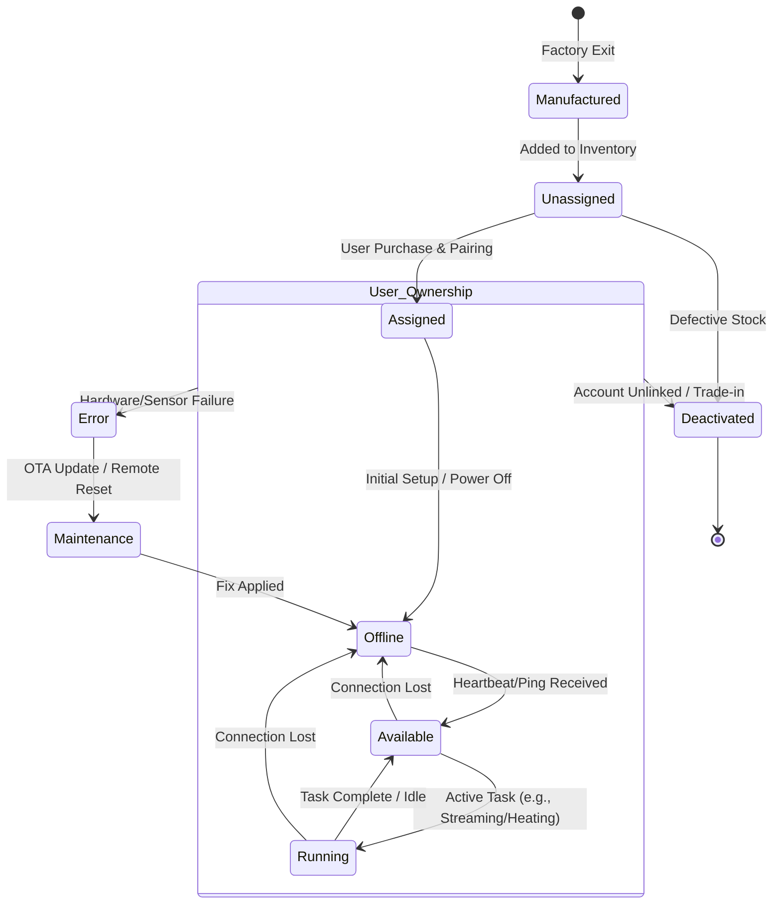

# dmu

States:

For an IoT device, the lifecycle transitions from "warehouse inventory" to "active user hardware." In this context, **Assigned** represents the moment the device is paired with a user's account (the "bought" phase).

Here is the state flow tailored for an IoT device lifecycle:

### IoT Device State Diagram

---

### Logic Breakdown for IoT Context

Here is how these statuses function in a real-world IoT ecosystem:

| State | IoT Context |
| :--- | :--- |
| **Manufactured** | The device has a MAC address and Serial Number but isn't in the cloud database yet. |
| **Unassigned** | Sitting in a box at a warehouse or retail store. It is "Born" but has no "Owner." |
| **Assigned** | **The Purchase Event.** The user scans a QR code; the device is now cryptographically linked to a user ID. |
| **Offline** | The device is not pinging the server (unplugged, dead battery, or Wi-Fi is down). |
| **Available** | The device is "Standby." It’s connected to Wi-Fi and waiting for a command from the app. |
| **Running** | The device is actively performing its function (e.g., a smart camera recording or a plug passing current). |
| **Error** | A self-diagnostic check failed (e.g., "Overheating" or "Sensor Blocked"). |
| **Maintenance** | The device is locked for an **OTA (Over-The-Air) firmware update** or a factory reset. |
| **Deactivated** | The user has "Removed Device" from their app. It is now a paperweight until refurbished or recycled. |

---

### Key Transitions
* **The "First Connection":** Usually goes from **Assigned** $\rightarrow$ **Offline** $\rightarrow$ **Available**.
* **The "Heartbeat":** IoT devices constantly flip between **Available** and **Offline** depending on signal strength.
* **Safety Lock:** If an **Error** is detected while **Running**, the system should automatically force it into **Maintenance** or **Offline** to prevent damage.

**Would you like me to generate some sample Python code (or JSON) that handles these state transitions for a device simulator?**